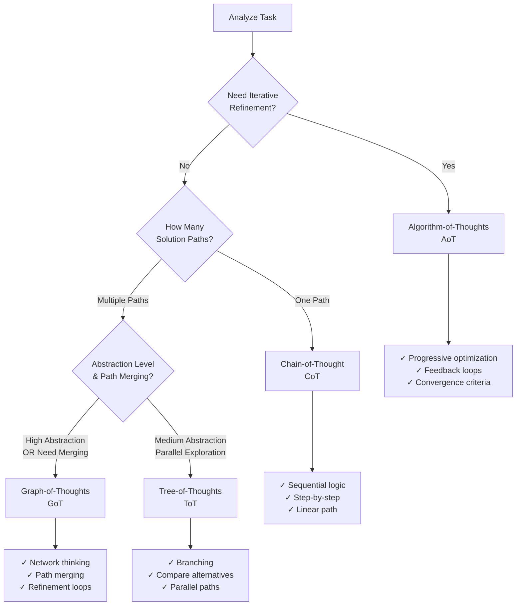

# Reasoning Frameworks Reference

## Overview

Advanced reasoning frameworks are cognitive architectures that guide how AI models process and respond to prompts. This document covers the 4 primary frameworks used in Lyra v2:

1. **Chain-of-Thought (CoT)** - Linear, step-by-step reasoning
2. **Tree-of-Thoughts (ToT)** - Branching exploration of multiple solution paths
3. **Graph-of-Thoughts (GoT)** - Complex interconnected reasoning with path merging
4. **Algorithm-of-Thoughts (AoT)** - Iterative refinement through optimization loops

---

## Framework Selection Decision Tree



---

## Chain-of-Thought (CoT)

### Definition

Chain-of-Thought prompting encourages models to show intermediate reasoning steps before arriving at a final answer. This makes reasoning transparent and improves accuracy on complex problems.

### When to Use

**Best for:**
- Problems with single clear solution path
- Tasks requiring sequential logical steps
- Mathematical or analytical problems
- Debugging and troubleshooting
- Explaining complex concepts

**Indicators:**
- Task can be broken into linear steps
- Each step builds on the previous one
- Order of operations matters
- Need to show your work

**Not recommended for:**
- Simple factual queries
- Tasks needing multiple alternatives
- Highly creative or open-ended problems

### Implementation Pattern

**Basic CoT:**
```markdown
[Task instruction]

Think step-by-step:
1. First, consider...
2. Then, analyze...
3. Finally, conclude...
```

**Advanced CoT:**
```markdown
You are [expert role].

Task: [Clear task description]

Break this down step-by-step:
- Step 1: [Specific action]
- Step 2: [Specific action]
- Step 3: [Specific action]

For each step, explain your reasoning before proceeding to the next.

Final answer: [Format specification]
```

### Real-World Examples

**Example 1: Code Review**

Before:
```
Review this code.
```

After (CoT):
```
Review this Python code following these steps:

1. Syntax and Style: Check PEP 8 compliance, naming conventions
2. Logic and Correctness: Verify algorithm correctness, edge cases
3. Performance: Identify bottlenecks, unnecessary operations
4. Security: Check for vulnerabilities, input validation
5. Maintainability: Assess readability, modularity

For each step, explain what you found and why it matters.

Final output: Summary table with Issues | Severity | Recommendation
```

**Example 2: Decision Making**

Before:
```
Should I use MongoDB or PostgreSQL?
```

After (CoT):
```
Analyze whether MongoDB or PostgreSQL is better for this use case.

Step 1: Identify data characteristics
- Is the data structured or unstructured?
- Do relationships matter?
- What's the query pattern?

Step 2: Compare against requirements
- Read/write ratio
- Scale expectations
- Transaction needs
- Team expertise

Step 3: Evaluate tradeoffs
- List pros/cons for each option
- Weight by importance

Step 4: Recommendation
- Choose one with clear justification

Think through each step explicitly before moving to the next.
```

### Performance Metrics

**Impact:**
- Accuracy improvement: +15-30% on reasoning tasks
- Token overhead: +30-60% (worth it for complex tasks)
- Time overhead: Minimal (model thinks faster than it types)

**Token Efficiency:**
- Use CoT for complex tasks only
- For simple tasks, skip intermediate steps
- Balance reasoning depth with token budget

---

## Tree-of-Thoughts (ToT)

### Definition

Tree-of-Thoughts extends CoT by exploring multiple reasoning branches in parallel, comparing alternatives, and selecting the best path. Like a decision tree, it evaluates different approaches before committing.

### When to Use

**Best for:**
- Multiple valid solution approaches
- Need to compare alternatives
- Complex decision-making
- Creative problem-solving
- Trade-off analysis

**Indicators:**
- "What are the options?"
- "Compare approaches A, B, C"
- Multiple paths to explore
- Need to evaluate alternatives before choosing

**Not recommended for:**
- Single clear solution
- Time-sensitive tasks (slower than CoT)
- Very simple problems

### Implementation Pattern

**Basic ToT:**
```markdown
[Task description]

Explore these approaches in parallel:
1. Approach A: [Description]
2. Approach B: [Description]
3. Approach C: [Description]

For each approach, evaluate:
- Pros
- Cons
- Tradeoffs

Then select the best approach and explain why.
```

**Advanced ToT:**
```markdown
You are [expert role].

Task: [Complex task requiring alternatives]

Branch Exploration:
Branch 1: [Approach 1 name]
  - Implementation path
  - Expected benefits
  - Potential risks
  
Branch 2: [Approach 2 name]
  - Implementation path
  - Expected benefits
  - Potential risks
  
Branch 3: [Approach 3 name]
  - Implementation path
  - Expected benefits
  - Potential risks

Evaluation Criteria:
- [Criterion 1]
- [Criterion 2]
- [Criterion 3]

Final Decision:
Select the best branch and provide detailed justification.
```

### Real-World Examples

**Example 1: Architecture Selection**

Before:
```
What architecture should I use for my app?
```

After (ToT):
```
Evaluate the best architecture for a social media app (1M users, real-time features).

Explore 3 architectural approaches:

Branch 1: Monolithic Architecture
- Describe implementation
- List benefits (simplicity, easier debugging)
- List drawbacks (scaling limits, deployment risks)

Branch 2: Microservices Architecture
- Describe implementation
- List benefits (scalability, independent deployment)
- List drawbacks (complexity, distributed system challenges)

Branch 3: Serverless Architecture
- Describe implementation
- List benefits (auto-scaling, cost efficiency)
- List drawbacks (cold starts, vendor lock-in)

Evaluation criteria:
- Development speed (weight: 30%)
- Scalability (weight: 40%)
- Cost (weight: 20%)
- Team expertise (weight: 10%)

Final recommendation: Select the best architecture with detailed justification.
```

**Example 2: API Design**

Before:
```
Design an API for user management.
```

After (ToT):
```
Design a user management API. Explore these approaches:

Branch 1: RESTful API
- Endpoints structure
- Pros: Standard, widely understood, cacheable
- Cons: Multiple requests for complex operations, versioning complexity

Branch 2: GraphQL API
- Schema structure
- Pros: Flexible queries, single endpoint, type-safe
- Cons: Complexity, caching challenges, learning curve

Branch 3: gRPC API
- Service definition
- Pros: High performance, type-safe, streaming
- Cons: Limited browser support, tooling complexity

Consider: Team expertise, client requirements, performance needs

Select the best approach and provide implementation guide.
```

### Performance Metrics

**Impact:**
- Decision quality: +25-40% (more thorough evaluation)
- Token overhead: +80-150% (explores multiple paths)
- Time overhead: Moderate (parallel thinking)

---

## Graph-of-Thoughts (GoT)

### Definition

Graph-of-Thoughts represents reasoning as a network where thoughts can connect, merge, and refine in non-linear ways. Unlike trees (one-way branching), graphs allow paths to merge, creating refinement loops and complex interconnections.

### When to Use

**Best for:**
- Highly complex, multi-dimensional problems
- Problems with interconnected components
- Need for iterative refinement within exploration
- System-level thinking
- Abstract conceptual work

**Indicators:**
- "How do these components interact?"
- "Analyze the system as a whole"
- Multiple interconnected factors
- Need path merging and refinement
- High abstraction level

**Not recommended for:**
- Simple linear problems
- Time-sensitive tasks (most complex framework)
- Low abstraction tasks

### Implementation Pattern

**Basic GoT:**
```markdown
[Complex task description]

Construct a thought graph:

Node 1: [Initial concept]
  ↓ connects to
Node 2: [Related concept]
  ↓ connects to
Node 3: [Third concept]
  ↑ feeds back to Node 1

Analyze connections:
- How does Node 1 influence Node 2?
- How does Node 3 refine Node 1?
- What emergent properties arise?

Synthesize insights from the complete graph.
```

**Advanced GoT:**
```markdown
You are [systems thinking expert].

Task: [Complex multi-dimensional problem]

Phase 1: Build Thought Network
Node A: [Core concept 1]
Node B: [Core concept 2]
Node C: [Core concept 3]
Node D: [Core concept 4]

Phase 2: Map Connections
- A → B: [How A influences B]
- B → C: [How B influences C]
- C → D: [How C influences D]
- D → A: [Feedback loop to A]
- A ↔ C: [Bidirectional influence]

Phase 3: Identify Emergent Properties
- What patterns emerge from the network?
- What are the feedback loops?
- What are the leverage points?

Phase 4: Refine Through Iteration
- Revisit Node A with insights from D
- Refine Node B with insights from C
- Synthesize final understanding

Final Output: [Comprehensive synthesis]
```

### Real-World Examples

**Example 1: System Optimization**

Before:
```
Optimize my application performance.
```

After (GoT):
```
Analyze and optimize application performance using systems thinking.

Construct Performance Network:

Node A: Frontend Performance
  - Metrics: FCP, TTI, LCP
  - Factors: Bundle size, render blocking, lazy loading

Node B: Backend Performance
  - Metrics: Response time, throughput, latency
  - Factors: Query optimization, caching, connection pooling

Node C: Database Performance
  - Metrics: Query time, connection count, index efficiency
  - Factors: Schema design, indexing, query patterns

Node D: Infrastructure
  - Metrics: CPU, memory, network bandwidth
  - Factors: Scaling strategy, resource allocation, CDN

Analyze Interconnections:
- A → B: Frontend requests impact backend load
- B → C: Backend queries affect database performance
- C → D: Database usage affects infrastructure resources
- D → A: Infrastructure limitations create frontend bottlenecks
- A ↔ C: Direct data fetching patterns

Identify Feedback Loops:
- More users → More load → Slower response → Worse UX → User frustration
- Caching → Faster response → More usage → Need more caching

Find Leverage Points:
- Where can small changes create biggest impact?
- What are the bottlenecks limiting the entire system?

Refinement:
- Revisit Node A with insights from infrastructure constraints
- Optimize Node B based on database query patterns
- Refine Node C with frontend data needs

Final Output: Prioritized optimization plan addressing the system holistically.
```

### Performance Metrics

**Impact:**
- Problem understanding: +40-60% (holistic view)
- Token overhead: +150-250% (most comprehensive)
- Time overhead: High (complex reasoning)

---

## Algorithm-of-Thoughts (AoT)

### Definition

Algorithm-of-Thoughts applies iterative refinement through progressive optimization loops. Like an algorithm, it generates solutions, evaluates them, and refines them until convergence criteria are met.

### When to Use

**Best for:**
- Optimization problems
- Iterative improvement tasks
- Quality refinement
- Progressive enhancement
- Converging on best solution

**Indicators:**
- "Optimize until..."
- "Refine iteratively"
- "Keep improving until [criteria]"
- Need progressive enhancement
- Quality threshold defined

**Not recommended for:**
- One-shot tasks
- Exploration without clear goal
- Tasks without measurable improvement

### Implementation Pattern

**Basic AoT:**
```markdown
[Task description]

Iterative Optimization Loop:

Iteration 1: Generate initial solution
  → Evaluate against criteria
  → Identify improvements

Iteration 2: Apply improvements
  → Re-evaluate
  → Identify further improvements

Continue until [convergence criteria]

Final output: Best solution after iterations
```

**Advanced AoT:**
```markdown
You are [expert role].

Task: [Optimization task]

Optimization Parameters:
- Success criteria: [What defines "good enough"]
- Constraints: [Boundaries and limits]
- Iteration limit: [Max iterations]

Algorithm:
1. Generate initial solution (v1)
2. Evaluate against criteria → score
3. Identify top 3 improvement opportunities
4. Apply improvements → v2
5. Re-evaluate → new score
6. IF score improvement < 5% OR iterations >= limit:
     STOP
   ELSE:
     GOTO step 3

Track each iteration:
- Version number
- Score
- Key changes
- Improvement delta

Final output: Best version with iteration history
```

### Real-World Examples

**Example 1: Prompt Refinement**

Before:
```
Improve this prompt.
```

After (AoT):
```
Iteratively optimize this prompt using Algorithm-of-Thoughts.

Original Prompt: [User's prompt]

Success Criteria:
- Clarity score > 85/100
- Specificity score > 80/100
- Token efficiency > 75/100
- Anti-patterns = 0

Iteration 1:
- Current prompt: [Original]
- Evaluation scores: [Calculate]
- Top 3 issues: [Identify]
- Improvements: [Apply]
- Revised prompt: [v1]

Iteration 2:
- Current prompt: [v1]
- Evaluation scores: [Calculate]
- Score delta: [Compare to original]
- Top 3 issues: [Identify]
- Improvements: [Apply]
- Revised prompt: [v2]

Continue iterations until improvement delta < 5% or 5 iterations reached.

Final output:
- Best version
- Iteration history (scores)
- Total improvement metrics
```

**Example 2: Code Optimization**

Before:
```
Optimize this function.
```

After (AoT):
```
Optimize this function iteratively using AoT.

Function: [Code here]

Optimization Goals:
- Time complexity: O(n) or better
- Memory usage: < 1MB
- Readability: Maintainable by junior developers

Iteration Loop:

v1 (Initial Analysis):
- Current complexity: [Analyze]
- Bottlenecks: [Identify]
- Low-hanging fruit: [List]
→ Apply improvements

v2 (First Optimization):
- Improvements made: [List]
- New complexity: [Measure]
- Remaining issues: [Identify]
→ Apply improvements

v3 (Second Optimization):
- Improvements made: [List]
- Performance delta: [Calculate]
- Diminishing returns? [Evaluate]

Continue until goals met or improvement < 10%

Final: Best version with performance comparison table
```

### Performance Metrics

**Impact:**
- Solution quality: +30-50% (progressive refinement)
- Token overhead: +100-200% (multiple iterations)
- Time overhead: High (multiple passes)

---

## Framework Comparison Matrix

| Framework | Complexity | Token Overhead | Time | Best For | Output Type |
|-----------|-----------|---------------|------|----------|-------------|
| **CoT** | Low | +30-60% | Fast | Linear problems, step-by-step | Single solution with reasoning |
| **ToT** | Medium | +80-150% | Moderate | Multiple alternatives | Best choice + comparison |
| **GoT** | High | +150-250% | Slow | Complex systems | Holistic synthesis |
| **AoT** | Medium-High | +100-200% | Slow | Optimization | Refined solution + history |

---

## Quick Selection Guide

### If-Then Rules

```
IF task has single clear path AND needs transparency:
    → Chain-of-Thought (CoT)
    
IF task has multiple valid approaches AND need comparison:
    → Tree-of-Thoughts (ToT)
    
IF task involves interconnected systems AND high abstraction:
    → Graph-of-Thoughts (GoT)
    
IF task needs iterative improvement AND has quality criteria:
    → Algorithm-of-Thoughts (AoT)
```

### Task Type Mapping

| Task Type | Primary Framework | Secondary Option |
|-----------|------------------|------------------|
| Mathematical problem | CoT | AoT (if optimization) |
| Architecture decision | ToT | GoT (if complex) |
| System analysis | GoT | ToT (if comparing options) |
| Code optimization | AoT | CoT (if explanation focus) |
| Debugging | CoT | ToT (if multiple hypotheses) |
| Creative writing | ToT | GoT (if exploring themes) |
| Data analysis | CoT | AoT (if refining insights) |
| API design | ToT | GoT (if system integration) |

---

## Platform-Specific Recommendations

### Claude (Anthropic)

**Preferred frameworks:** All supported, especially GoT (excels at complex reasoning)

**Optimization tips:**
- Use XML tags to structure multi-step reasoning
- Request explicit thinking blocks
- Leverage long context for comprehensive analysis

**Example:**
```xml
<thinking>
Apply Chain-of-Thought reasoning here.
Show all intermediate steps.
</thinking>

<answer>
Final answer based on reasoning above.
</answer>
```

### ChatGPT (OpenAI)

**Preferred frameworks:** CoT, ToT (structured reasoning works well)

**Optimization tips:**
- Use numbered lists for steps
- Clear section headers
- System message for framework guidance
- User message for task

**Example:**
```markdown
System: You use step-by-step reasoning for all responses.

User: [Task]

Instructions:
1. Break down the problem
2. Solve each part
3. Combine into final answer
```

### Gemini (Google)

**Preferred frameworks:** CoT, ToT (good at comparative analysis)

**Optimization tips:**
- Request citations for each reasoning step
- Use comparative structures
- Keep prompts concise (<4K chars)
- Leverage search capabilities

**Example:**
```markdown
Compare these 3 approaches to [problem]:

Option 1: [Description]
- Cite evidence for effectiveness
- List pros/cons

Option 2: [Description]
- Cite evidence for effectiveness
- List pros/cons

Option 3: [Description]
- Cite evidence for effectiveness
- List pros/cons

Recommend the best option with citations.
```

---

## Advanced: Combining Frameworks

### Multi-Framework Approach

For revolutionary-level optimization, combine frameworks:

**CoT + ToT:**
```
1. Use ToT to explore alternatives
2. For each alternative, use CoT to detail implementation
3. Compare detailed implementations
```

**GoT + AoT:**
```
1. Use GoT to map system interconnections
2. Use AoT to iteratively optimize each subsystem
3. Re-evaluate system after optimizations
```

**ToT + AoT:**
```
1. Use ToT to generate alternative approaches
2. Use AoT to refine the most promising approach
3. Compare refined version to alternatives
```

### When to Combine

**Indicators:**
- Extremely complex problems
- Multi-dimensional optimization
- Need both exploration and refinement
- Revolutionary-level optimization requested

**Caution:**
- Token cost multiplies
- Complexity increases significantly
- Only for truly complex problems

---

## Framework Implementation Checklist

### Chain-of-Thought (CoT)

- [ ] Break task into sequential steps
- [ ] Each step clearly defined
- [ ] Request explicit reasoning
- [ ] Specify final output format
- [ ] Consider edge cases per step

### Tree-of-Thoughts (ToT)

- [ ] Define all branches to explore
- [ ] Specify evaluation criteria
- [ ] Request comparison analysis
- [ ] Include selection justification
- [ ] Balance breadth vs depth

### Graph-of-Thoughts (GoT)

- [ ] Identify all key nodes
- [ ] Map interconnections
- [ ] Specify feedback loops
- [ ] Request emergent property analysis
- [ ] Include refinement iterations

### Algorithm-of-Thoughts (AoT)

- [ ] Define success criteria
- [ ] Specify iteration limit
- [ ] Request evaluation metrics
- [ ] Track improvement deltas
- [ ] Define convergence criteria

---

## Common Mistakes

### Mistake 1: Framework Overkill

**Problem:** Using complex framework for simple task

**Example:**
- Task: "What is 2+2?"
- Wrong: Apply GoT with network analysis
- Right: Direct answer (no framework needed)

**Fix:** Match framework complexity to task complexity

### Mistake 2: Missing Evaluation Criteria

**Problem:** Using ToT or AoT without clear criteria

**Example:**
- "Explore 3 approaches" (no criteria for comparison)
- "Refine iteratively" (no definition of "better")

**Fix:** Always specify evaluation criteria for branching/iterative frameworks

### Mistake 3: Over-Constraining

**Problem:** Too many steps in CoT, too many branches in ToT

**Example:**
- CoT with 20 steps (overwhelming)
- ToT with 10 branches (too broad)

**Fix:** 
- CoT: 3-7 steps maximum
- ToT: 2-5 branches maximum
- GoT: 4-8 nodes maximum
- AoT: 3-5 iterations maximum

### Mistake 4: Wrong Platform Match

**Problem:** Using framework that platform doesn't handle well

**Example:**
- Complex GoT on platform with short context limits
- XML-structured thinking on non-Claude platform

**Fix:** Consult platform-specific recommendations above

---

## Vietnamese Explanations

### Chain-of-Thought (Chuỗi Suy Nghĩ)

**Giải thích:** CoT giống như việc bạn giải toán trên giấy - viết từng bước một thay vì chỉ viết đáp án cuối. Điều này giúp AI "suy nghĩ" rõ ràng hơn và cho kết quả chính xác hơn.

**Khi nào dùng:** Khi bạn cần AI giải thích logic, làm toán, hoặc phân tích vấn đề phức tạp theo trình tự.

**Mẹo nhớ:** "Chuỗi" = từng bước nối tiếp nhau, như chuỗi hạt.

### Tree-of-Thoughts (Cây Suy Nghĩ)

**Giải thích:** ToT giống như khi bạn vẽ sơ đồ cây quyết định - khám phá nhiều nhánh giải pháp rồi chọn nhánh tốt nhất. Thay vì đi thẳng một đường, AI thử nhiều đường và so sánh.

**Khi nào dùng:** Khi có nhiều cách giải quyết và bạn muốn AI so sánh ưu nhược điểm từng cách.

**Mẹo nhớ:** "Cây" = nhiều nhánh, khám phá rồi chọn nhánh tốt nhất.

### Graph-of-Thoughts (Đồ Thị Suy Nghĩ)

**Giải thích:** GoT giống như vẽ bản đồ tư duy (mind map) - các ý tưởng kết nối với nhau theo mạng lưới, không chỉ một chiều. Các suy nghĩ có thể "feed back" vào nhau để tinh chỉnh.

**Khi nào dùng:** Khi vấn đề rất phức tạp, có nhiều yếu tố liên quan đến nhau, cần nhìn toàn cảnh hệ thống.

**Mẹo nhớ:** "Đồ thị" = mạng lưới nhiều chiều, không phải cây một chiều.

### Algorithm-of-Thoughts (Thuật Toán Suy Nghĩ)

**Giải thích:** AoT giống như thuật toán tối ưu hóa - tạo giải pháp ban đầu, đánh giá, cải thiện, đánh giá lại, lặp lại cho đến khi đạt tiêu chí.

**Khi nào dùng:** Khi bạn muốn AI liên tục cải thiện câu trả lời cho đến khi đạt chất lượng mong muốn.

**Mẹo nhớ:** "Thuật toán" = quy trình lặp đi lặp lại để tối ưu.

---

## Further Reading

### Research Papers

- **CoT:** "Chain-of-Thought Prompting Elicits Reasoning in Large Language Models" (Wei et al., 2022)
- **ToT:** "Tree of Thoughts: Deliberate Problem Solving with Large Language Models" (Yao et al., 2023)
- **GoT:** "Graph of Thoughts: Solving Elaborate Problems with Large Language Models" (Besta et al., 2023)
- **AoT:** "Algorithm of Thoughts: Enhancing Exploration of Ideas" (Sel et al., 2023)

### Practical Guides

- See `examples/deep-dive/chain-of-thought.md` for CoT examples
- See `examples/revolutionary/graph-of-thoughts.md` for GoT examples
- See `examples/revolutionary/multi-framework.md` for combination patterns

---

## Summary

**Framework Selection:**
1. Start with task analysis (single path? multiple paths? iterative?)
2. Use decision tree to select framework
3. Implement pattern appropriate to chosen framework
4. Validate framework choice produces better results

**Remember:**
- Simple problems don't need complex frameworks
- Match framework to task complexity
- Platform capabilities matter
- Token overhead is worth it for complex tasks
- Learn by studying examples

**Next:** Consult `optimization-toolkit.md` to learn specific techniques to combine with these frameworks.
