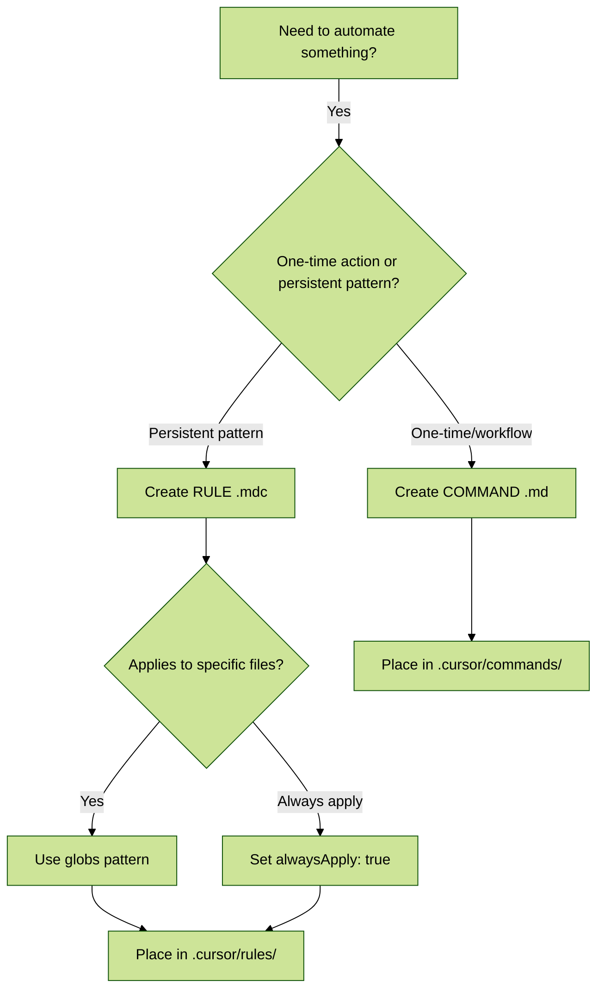
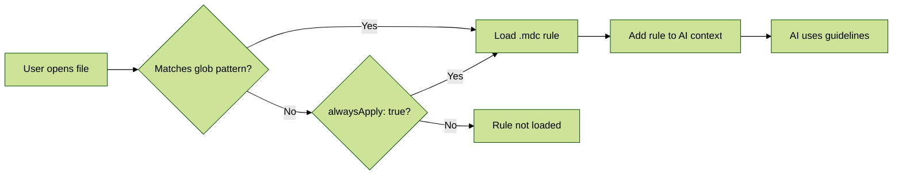
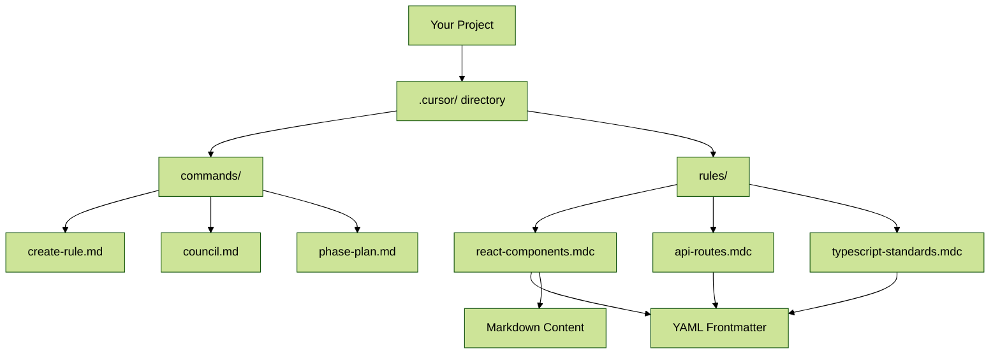
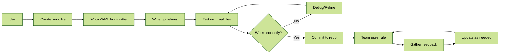

# Creating Effective Cursor Project Rules

> **⚠️ IMPORTANT DISTINCTION**  
> This command teaches you how to create **RULES** (`.mdc` files in `.cursor/rules/`), NOT commands.
>
> **Commands** (`.md` files in `.cursor/commands/`):
> - ❌ **NO YAML frontmatter needed**
> - ⚙️ Action-oriented workflows
> - 🎯 Manual invocation via `/command-name`
>
> **Rules** (`.mdc` files in `.cursor/rules/`):
> - ✅ **YAML frontmatter REQUIRED**
> - 📋 Pattern-based persistent instructions
> - 🔄 Auto-activate based on file patterns

---

## 📑 Table of Contents

- [Quick Start](#-quick-start)
- [What are Cursor Project Rules?](#-what-are-cursor-project-rules)
  - [Commands vs Rules](#commands-vs-rules)
  - [When to Use Rules](#when-to-use-rules)
- [Rule File Structure](#-rule-file-structure)
  - [YAML Frontmatter](#1-yaml-frontmatter-required)
  - [Content Sections](#2-content-sections-recommended-structure)
- [Graduated Examples](#-graduated-examples)
  - [Basic: Single File Pattern](#basic-level-single-file-pattern)
  - [Intermediate: Multiple Patterns](#intermediate-level-multiple-patterns)
  - [Advanced: Complex Patterns with @file](#advanced-level-complex-patterns-with-file)
- [Quick Rule Generator](#-quick-rule-generator)
- [Advanced Features](#-advanced-features)
  - [File References (@file)](#file-references-file)
  - [Code Blocks](#code-blocks)
- [Rule Activation Flow](#-rule-activation-flow)
- [Troubleshooting](#-troubleshooting)
  - [Rule Not Loading](#issue-1-rule-not-loading)
  - [Glob Pattern Not Matching](#issue-2-glob-pattern-not-matching)
  - [YAML Syntax Errors](#issue-3-yaml-syntax-errors)
  - [Performance Issues](#issue-4-performance-issues-large-rules)
  - [Rule Conflicts](#issue-5-rule-conflicts-multiple-matches)
  - [@file References Not Loading](#issue-6-file-references-not-loading)
- [Best Practices](#-best-practices)
- [Team Collaboration](#-team-collaboration)
- [Changelog](#-changelog)

---

## ⚡ Quick Start

**TL;DR**: Create a `.mdc` file in `.cursor/rules/` with YAML frontmatter + markdown content.

**3 Steps to Your First Rule:**

1. **Create file**: `.cursor/rules/my-first-rule.mdc`
2. **Add YAML frontmatter**:
   ```yaml
   ---
   title: TypeScript Standards
   description: Guidelines for TypeScript files
   globs: **/*.ts
   alwaysApply: false
   ---
   ```
3. **Write your guidelines** in markdown below the frontmatter

💡 **Pro tip**: Start simple! You can always expand your rule later as you learn what works best for your project.

👇 **Want more detail?** Keep reading for comprehensive guidance, examples, and troubleshooting.

---

## 🎯 What are Cursor Project Rules?

Project Rules are persistent, project-specific instructions stored as `.mdc` files in `.cursor/rules/` that help Cursor's AI understand your codebase, conventions, and preferences. They're automatically activated when files matching their patterns are referenced in chat or other AI features.

Think of them as a structured knowledge base for your project, teaching the AI:

- ✅ Coding conventions and style guides
- ✅ Architectural patterns
- ✅ API usage and interfaces
- ✅ Domain-specific knowledge
- ✅ Your personal or team preferences

### Commands vs Rules

Understanding when to use each is crucial for effective workflow:



| Aspect | Commands (`.md`) | Rules (`.mdc`) |
|--------|-----------------|---------------|
| **File Extension** | `.md` | `.mdc` |
| **Location** | `.cursor/commands/` | `.cursor/rules/` |
| **YAML Frontmatter** | ❌ Not needed | ✅ Required |
| **Activation** | Manual (`/command-name`) | Automatic (glob match) |
| **Purpose** | Action/workflow | Pattern/standard |
| **Example Use** | "Create PR", "Run tests" | "React guidelines", "TypeScript rules" |
| **Scope** | Single invocation | Persistent across files |
| **Parameters** | Text after command | File context |

### When to Use Rules

**Use Rules when you want to:**
- ✅ Define coding standards for specific file types
- ✅ Establish framework conventions (React, Vue, Flutter, etc.)
- ✅ Document architectural patterns
- ✅ Provide file-specific guidelines that apply consistently

**Use Commands when you want to:**
- ✅ Execute one-time actions (create, review, deploy)
- ✅ Automate multi-step workflows
- ✅ Implement repeatable team procedures
- ✅ Trigger specific AI behaviors on demand

---

## 📐 Rule File Structure

A well-structured rule file has two main parts: YAML frontmatter and markdown content.

### 1. YAML Frontmatter (Required)

> ⚠️ **CRITICAL**: The YAML frontmatter block (`--- ... ---`) **must** be the absolute first content in your `.mdc` file. Any leading spaces, lines, or characters will prevent the rule from loading.

```yaml
---
title: Brief Title of the Rule                    # 5-7 words recommended
description: Guidelines for [what this covers]    # Helps AI select relevant rules
globs: pattern/to/match/files/**/*.{ext}         # Note: "globs" (plural), not "glob"!
alwaysApply: false                                # Optional: Set to true for global rules
---
```

#### YAML Field Explanations

- **`title`**: A clear, descriptive title for your rule
- **`description`**: A concise, semantic description starting with "Guidelines for..." or "Instructions on..."
- **`globs`**: File pattern(s) that trigger automatic activation. **Must be plural "globs:"**
- **`alwaysApply`**: Boolean - when `true`, rule applies regardless of file context

#### Glob Pattern Examples

Common patterns you can use:

```yaml
# TypeScript files
globs: **/*.ts,**/*.tsx

# React components
globs: src/components/**/*.{tsx,jsx}

# API routes in multiple directories
globs: src/api/**/*.ts,pages/api/**/*.ts

# Test files
globs: **/*.test.{ts,js},**/*.spec.{ts,js}

# Configuration files
globs: *.{json,yaml,yml}

# Specific files
globs: {package.json,tsconfig.json}

# Exclude patterns
globs: src/utils/!(test).ts
```

> ⚠️ **SPACING WARNING**: When using multiple patterns separated by commas:
> - ✅ **Correct**: `globs: **/*.ts,**/*.tsx` (no space after comma)
> - ❌ **Wrong**: `globs: **/*.ts, **/*.tsx` (space breaks matching!)
>
> 💡 **Alternative**: Use array format to avoid spacing issues:
> ```yaml
> globs:
>   - **/*.ts
>   - **/*.tsx
> ```

### 2. Content Sections (Recommended Structure)

Organize your rule's content logically using markdown headings:

```
.cursor/
├── commands/           # Plain .md files (NO YAML needed)
│   ├── create-rule.md
│   ├── council.md
│   └── phase-plan.md
└── rules/             # .mdc files (YAML required)
    ├── react-components.mdc
    ├── api-routes.mdc
    └── typescript-standards.mdc
```

#### Introduction / Problem

- Briefly explain **what** problem this rule solves
- Explain **why** this pattern/convention is important
- Mention **when** this rule is typically relevant

#### Pattern Description

- Clearly document recommended patterns or conventions
- Use text + code examples with language-specific fenced blocks
- Highlight key components, functions, or concepts
- Link to related rules: `[See API Conventions](mdc:api-conventions.mdc)`

#### Implementation Steps (If Applicable)

- Provide clear, step-by-step guide
- Use numbered lists
- Identify decision points or variations

#### Real-World Examples (Highly Recommended)

- Link to actual code in your repository
- Explain why the example demonstrates the rule well
- Keep examples focused and relevant

#### Common Pitfalls / Anti-Patterns

- List common mistakes
- Explain how to recognize issues
- Suggest fixes or preventive measures

> 💡 **Note**: Adapt this structure based on complexity. Simpler rules might only need frontmatter + brief description.

---

## 🎓 Graduated Examples

Learn by example, progressing from simple to complex rules.

### Basic Level: Single File Pattern

**Use Case**: Apply standards to one type of file

```yaml
---
title: TypeScript Utilities Standards          # Clear, specific title
description: Guidelines for utility functions  # What this rule covers
globs: src/utils/**/*.ts                      # Matches all .ts files in utils
alwaysApply: false                            # Only applies to matching files
---

# TypeScript Utilities Standards

## Purpose

Utility functions should be pure, testable, and reusable across the project.

## Guidelines

- ✅ Use pure functions (no side effects)
- ✅ Include JSDoc comments
- ✅ Export as named exports
- ✅ Keep utilities focused (single responsibility)

## Example

\`\`\`typescript
/**
 * Formats a date string to YYYY-MM-DD format
 * @param date - Date object or ISO string
 * @returns Formatted date string
 */
export function formatDate(date: Date | string): string {
  const d = typeof date === 'string' ? new Date(date) : date;
  return d.toISOString().split('T')[0];
}
\`\`\`
```

### Intermediate Level: Multiple Patterns

**Use Case**: Apply standards to related file types

```yaml
---
title: React Component Guidelines                    # Covers multiple file types
description: Standards for functional React components
globs: src/components/**/*.{tsx,jsx}                # Matches both .tsx and .jsx
alwaysApply: false
---

# React Component Guidelines

## Component Structure

Components should follow this order:

\`\`\`typescript
'use client'  // 1. Client directive (if needed)

// 2. Imports (grouped by type)
import React, { useState, useEffect } from 'react';  // React imports
import { Button } from '@/components/ui';            // Internal imports

// 3. Type definitions
interface Props {
  title: string;
  onSave: () => void;
}

// 4. Component function
export function MyComponent({ title, onSave }: Props) {
  // 5. State hooks first
  const [isLoading, setIsLoading] = useState(false);
  
  // 6. Other hooks (useEffect, useMemo, useCallback)
  useEffect(() => {
    // Effect logic
  }, []);
  
  // 7. Event handlers
  const handleClick = () => {
    setIsLoading(true);
    onSave();
  };
  
  // 8. Return JSX
  return (
    <div>
      <h1>{title}</h1>
      <Button onClick={handleClick}>Save</Button>
    </div>
  );
}
\`\`\`

## Common Pitfalls

- ❌ Forgetting `'use client'` when using hooks
- ❌ Defining functions inside component without `useCallback`
- ❌ Not using TypeScript for props
```

### Advanced Level: Complex Patterns with @file

**Use Case**: Multiple patterns + external context files

```yaml
---
title: API Route Conventions                              # Complex multi-directory rule
description: Backend API structure and patterns
globs: src/api/**/*.ts,src/routes/**/*.ts,pages/api/**/*.ts  # Multiple directories
alwaysApply: false
---

@file ../../tsconfig.json     # Include TypeScript config for context
@file ../../package.json       # Include dependencies
@file ../docs/API_DESIGN.md    # Include API design documentation

# API Route Conventions

## Route Structure

\`\`\`typescript
// src/api/users/[id].ts

import { NextRequest, NextResponse } from 'next/server';  // Framework imports
import { z } from 'zod';                                    // Validation library
import { db } from '@/lib/db';                             // Internal utilities

// 1. Define validation schemas
const UserSchema = z.object({
  id: z.string().uuid(),
  email: z.string().email(),
  name: z.string().min(1),
});

// 2. Handler function with proper error handling
export async function GET(
  request: NextRequest,
  { params }: { params: { id: string } }
) {
  try {
    // 3. Validate input
    const { id } = UserSchema.pick({ id: true }).parse(params);
    
    // 4. Perform operation
    const user = await db.user.findUnique({ where: { id } });
    
    // 5. Handle not found
    if (!user) {
      return NextResponse.json(
        { error: 'User not found' },
        { status: 404 }
      );
    }
    
    // 6. Return success response
    return NextResponse.json(user);
  } catch (error) {
    // 7. Handle errors gracefully
    if (error instanceof z.ZodError) {
      return NextResponse.json(
        { error: 'Invalid input', details: error.errors },
        { status: 400 }
      );
    }
    
    console.error('API error:', error);
    return NextResponse.json(
      { error: 'Internal server error' },
      { status: 500 }
    );
  }
}
\`\`\`

## Best Practices

- ✅ Always validate input with Zod or similar
- ✅ Use proper HTTP status codes
- ✅ Handle errors gracefully
- ✅ Log errors for debugging
- ✅ Return consistent JSON structure
- ✅ Include TypeScript types for all handlers
```

---

## 💡 Quick Rule Generator

**Interactive Template**: Copy and modify to create your rule!

```yaml
---
title: {{YOUR_RULE_NAME}}                      # Example: "Python FastAPI Standards"
description: Guidelines for {{WHAT_THIS_COVERS}}  # Example: "API endpoint structure"
globs: {{FILE_PATTERN}}                        # Example: src/**/*.py
alwaysApply: false
---

# {{YOUR_RULE_NAME}}

## Purpose

[Explain what this rule is for and why it matters]

## Guidelines

- ✅ [First guideline]
- ✅ [Second guideline]
- ✅ [Third guideline]

## Example

\`\`\`{{LANGUAGE}}
// Your example code here
\`\`\`

## Common Pitfalls

- ❌ [Common mistake 1]
- ❌ [Common mistake 2]
```

### Common Pattern Templates

Choose a template that matches your use case:

#### TypeScript Files
```yaml
globs: **/*.ts,**/*.tsx
# or
globs:
  - **/*.ts
  - **/*.tsx
```

#### React Components
```yaml
globs: src/components/**/*.{tsx,jsx}
```

#### API Routes (Multiple Directories)
```yaml
globs: src/api/**/*.ts,pages/api/**/*.ts
```

#### Test Files
```yaml
globs: **/*.test.{ts,js},**/*.spec.{ts,js}
```

#### Python Files
```yaml
globs: src/**/*.py,tests/**/*.py
```

#### Flutter/Dart Files
```yaml
globs: lib/**/*.dart
```

#### Vue Components
```yaml
globs: src/components/**/*.vue
```

---

## 🔧 Advanced Features

### File References (`@file`)

Include critical context files directly within your rule using the `@file` directive. Place these **after** the frontmatter but **before** the main content.

```markdown
---
title: React Component Guidelines
description: Standards for React components
globs: src/components/**/*.tsx
alwaysApply: false
---

@file ../../tsconfig.json
@file ../../tailwind.config.js
@file ../docs/COMPONENT_ARCHITECTURE.md

# React Component Guidelines

[Your rule content here...]
```

**Best Practices**:
- ✅ Use relative paths from `.cursor/rules/` directory
- ✅ Include essential files only (configs, core types, architecture docs)
- ✅ Keep context minimal to avoid token overload
- ❌ Don't include large files or many files

**What to Include**:
- 💡 Configuration files (`tsconfig.json`, `package.json`)
- 💡 Type definition files
- 💡 Architecture documentation
- 💡 API specifications

### Code Blocks

Always use fenced code blocks with language specifiers:

````markdown
✅ **Good** - With language specifier:
```typescript
function greet(name: string): string {
  return `Hello, ${name}!`;
}
```

❌ **Bad** - Without language specifier:
```
function greet(name: string): string {
  return `Hello, ${name}!`;
}
```
````

This enables:
- ✅ Syntax highlighting
- ✅ Better AI understanding
- ✅ Improved readability

---

## 🔄 Rule Activation Flow

Understanding how rules are discovered and activated:



### Activation Methods

1. **Automatic Activation**: Rules activate when files matching `globs` pattern are included in context
   - Opened file in editor
   - @-referenced files
   - Files in `@codebase` search results

2. **Always Apply**: Set `alwaysApply: true` to include regardless of file context
   ```yaml
   ---
   title: Global Coding Standards
   description: Universal guidelines for all code
   globs: "**/*"
   alwaysApply: true  # Always included
   ---
   ```

3. **Manual Activation**: Explicitly include with `@Cursor Rules` symbol
   ```
   @Cursor Rules(react-component-guide.mdc) How should I structure this component?
   ```

4. **Semantic Selection**: Cursor uses the `description` field to choose the most relevant rule when multiple rules match

### Architecture Overview



### Rule Lifecycle Workflow



---

## 🛠️ Troubleshooting

Having issues with your rules? Here are solutions to the most common problems.

### Issue 1: Rule Not Loading

**Symptom**: Rule file exists in `.cursor/rules/` but doesn't activate when expected files are open.

**Diagnosis**: Check these common causes in order:

1. ⚠️ **YAML frontmatter syntax error**
   - Missing `---` delimiters
   - Incorrect indentation
   - Typo in field names (`glob` vs `globs`)

2. ⚠️ **Missing or incorrect `globs:` field**
   - Must be `globs:` (plural), not `glob:`
   - Pattern must match your file paths
   - Check for spacing issues (see Issue 2)

3. ⚠️ **File extension**
   - Must be `.mdc`, not `.md`
   - Check: `react-components.mdc` ✅ not `react-components.md` ❌

4. ⚠️ **Wrong directory**
   - Must be in `.cursor/rules/`
   - Not in `.cursor/commands/`

**Solution**:

```bash
# 1. Verify file location
ls -la .cursor/rules/

# 2. Check file has .mdc extension
# Should see: my-rule.mdc

# 3. Validate YAML syntax
# Ensure frontmatter starts with --- and ends with ---
# No leading spaces before ---

# 4. Test glob pattern
# Open a file that should match the pattern
# Rule should activate automatically
```

**Validation Checklist**:
- [ ] File is in `.cursor/rules/` directory
- [ ] File has `.mdc` extension
- [ ] YAML frontmatter is first content (no leading spaces/lines)
- [ ] YAML has proper `---` delimiters
- [ ] Field name is `globs:` (plural)
- [ ] Glob pattern matches target files

### Issue 2: Glob Pattern Not Matching

**Symptom**: Rule has `globs:` field but doesn't trigger on expected files.

**Diagnosis**: Pattern matching issues are usually caused by:

1. ⚠️ **Spacing in comma-separated patterns**
   ```yaml
   # ❌ WRONG (has space after comma)
   globs: **/*.ts, **/*.tsx
   
   # ✅ CORRECT (no space after comma)
   globs: **/*.ts,**/*.tsx
   ```

2. ⚠️ **Incorrect pattern syntax**
   - `*` matches within a directory
   - `**` matches any depth of directories
   - `{}` for alternation: `{tsx,jsx}`
   - `!()` for exclusion: `!(test)`

3. ⚠️ **Pattern too specific or too broad**
   ```yaml
   # Too specific (won't match nested files)
   globs: src/components/*.tsx
   
   # Better (matches nested directories)
   globs: src/components/**/*.tsx
   ```

**Solution**:

```yaml
# ✅ Option 1: No spaces in comma-separated list
globs: **/*.ts,**/*.tsx,**/*.js

# ✅ Option 2: Array format (recommended for readability)
globs:
  - **/*.ts
  - **/*.tsx
  - **/*.js

# ✅ Option 3: Brace expansion
globs: **/*.{ts,tsx,js}
```

**Common Pattern Reference**:

```yaml
# All TypeScript files
globs: **/*.ts

# TypeScript + TSX files
globs: **/*.{ts,tsx}

# Specific directory tree
globs: src/components/**/*.tsx

# Multiple directories
globs: src/**/*.ts,lib/**/*.ts,app/**/*.ts

# Exclude patterns
globs: src/**/*.ts,!src/**/*.test.ts

# Specific files only
globs: {package.json,tsconfig.json,README.md}
```

**Testing Glob Patterns**:
1. Create test rule with pattern
2. Open files that should match
3. Check if rule appears in AI context
4. Refine pattern if needed

### Issue 3: YAML Syntax Errors

**Symptom**: Rule doesn't load, or Cursor shows parsing errors.

**Diagnosis**: YAML is whitespace-sensitive and has strict syntax rules.

**Common YAML Mistakes**:

```yaml
# ❌ WRONG - Missing space after colon
title:React Component Guide

# ✅ CORRECT - Space after colon
title: React Component Guide

# ❌ WRONG - Wrong indentation in array
globs:
- **/*.ts
  - **/*.tsx

# ✅ CORRECT - Consistent indentation
globs:
  - **/*.ts
  - **/*.tsx

# ❌ WRONG - Unquoted special characters
description: Guidelines: React patterns

# ✅ CORRECT - Quoted when contains special chars
description: "Guidelines: React patterns"

# ❌ WRONG - Tab characters (use spaces)
title:	React Guide

# ✅ CORRECT - Spaces only
title: React Guide
```

**Solution**:

1. **Validate YAML online**: Copy your frontmatter to [yamllint.com](http://www.yamllint.com/)
2. **Use consistent indentation**: 2 spaces (no tabs)
3. **Quote strings with special characters**: `:`, `#`, `|`, `>`, etc.
4. **Check for trailing spaces**: Can cause parsing issues

**Valid YAML Template**:
```yaml
---
title: My Rule Title
description: Brief description of what this covers
globs: **/*.ts
alwaysApply: false
---
```

### Issue 4: Performance Issues (Large Rules)

**Symptom**: AI responses are slow, or rules seem to cause lag.

**Diagnosis**: Rule file is too large or includes too many `@file` references.

**Causes**:
- 📁 Very long rule content (1000+ lines)
- 📁 Many `@file` references (5+ files)
- 📁 Referenced files are large (>1000 lines each)
- 📁 `alwaysApply: true` on complex rules

**Solution**:

```yaml
# ❌ BAD - Loads too much context
---
title: Complete Backend Guide
description: Everything about backend
globs: **/*.ts
alwaysApply: true  # Always loaded, even when not needed!
---

@file ../../package.json
@file ../../tsconfig.json
@file ../docs/ARCHITECTURE.md
@file ../docs/DATABASE.md
@file ../docs/API.md
@file ../docs/SECURITY.md
@file ../src/types/index.ts

[10,000 lines of guidelines...]

# ✅ GOOD - Split into focused rules
---
title: API Route Conventions
description: Standards for API routes
globs: src/api/**/*.ts  # Only matches API files
alwaysApply: false      # Only loads when needed
---

@file ../../tsconfig.json  # Only essential context

[500 lines of focused API guidelines...]
```

**Best Practices**:
- 💡 Keep rules under 500 lines when possible
- 💡 Split large rules into focused smaller rules
- 💡 Use `alwaysApply: false` (only load when needed)
- 💡 Limit `@file` references to 2-3 essential files
- 💡 Reference summaries/docs instead of full source files

**Rule Organization Example**:
```
.cursor/rules/
├── typescript-basics.mdc       # 200 lines
├── react-components.mdc        # 300 lines
├── api-routes.mdc              # 400 lines
├── database-models.mdc         # 250 lines
└── testing-standards.mdc       # 300 lines

# Instead of:
├── everything.mdc              # 1,500 lines (too large!)
```

### Issue 5: Rule Conflicts (Multiple Matches)

**Symptom**: Multiple rules match the same file, and AI behavior is inconsistent.

**Diagnosis**: Overlapping glob patterns cause multiple rules to activate simultaneously.

**Example Conflict**:
```yaml
# Rule 1: typescript-general.mdc
globs: **/*.ts  # Matches ALL .ts files

# Rule 2: api-routes.mdc
globs: src/api/**/*.ts  # Matches API .ts files

# Rule 3: typescript-tests.mdc
globs: **/*.test.ts  # Matches test .ts files

# When editing: src/api/users.test.ts
# ALL THREE RULES MATCH! 🤯
```

**Solution**:

1. **Use more specific patterns**:
   ```yaml
   # ❌ TOO BROAD
   globs: **/*.ts

   # ✅ MORE SPECIFIC
   globs: src/utils/**/*.ts
   ```

2. **Use exclusion patterns**:
   ```yaml
   # General TypeScript rule (exclude tests and API)
   globs: **/*.ts,!**/*.test.ts,!src/api/**/*.ts
   ```

3. **Rely on semantic selection**:
   - Cursor uses `description` to pick most relevant rule
   - Write clear, specific descriptions

4. **Design rule hierarchy**:
   ```yaml
   # typescript-basics.mdc - Base standards
   title: TypeScript Basics
   description: General TypeScript standards
   globs: **/*.ts,!**/*.test.ts,!src/api/**/*.ts  # Exclude specialized files

   # api-routes.mdc - API-specific (more specific)
   title: API Route Standards
   description: Standards for API route files
   globs: src/api/**/*.ts  # Specific to API directory

   # typescript-tests.mdc - Test-specific (most specific)
   title: TypeScript Test Standards
   description: Standards for test files
   globs: **/*.test.ts  # Specific to tests
   ```

**Best Practices**:
- 💡 Make rules as specific as possible
- 💡 Use clear, distinct `description` fields
- 💡 Avoid overlapping patterns when possible
- 💡 Use directory-based organization
- 💡 Document rule relationships in comments

### Issue 6: @file References Not Loading

**Symptom**: `@file` directives in rule don't seem to include the referenced files.

**Diagnosis**: Path issues or file accessibility problems.

**Common Causes**:

1. **Incorrect relative path**:
   ```yaml
   # Rule location: .cursor/rules/react-components.mdc
   
   # ❌ WRONG - Path doesn't account for .cursor/rules/ location
   @file tsconfig.json
   
   # ✅ CORRECT - Relative path from .cursor/rules/
   @file ../../tsconfig.json
   ```

2. **File doesn't exist**:
   ```yaml
   # ❌ File path is misspelled or file missing
   @file ../../tscofnig.json  # Typo!
   
   # ✅ Verify file exists first
   @file ../../tsconfig.json
   ```

3. **File is too large**:
   - Files over 10,000 lines may not load
   - Very large files consume token budget

**Solution**:

```bash
# 1. Verify file exists
ls -la ../../tsconfig.json  # From .cursor/rules/ directory

# 2. Check path is correct
# Rule: .cursor/rules/my-rule.mdc
# Reference: @file ../../package.json
# Resolves to: ./package.json (project root)

# 3. Use absolute path from project root
@file /tsconfig.json  # If supported
```

**Path Reference Guide**:
```
Project structure:
my-project/
├── package.json
├── tsconfig.json
├── src/
│   └── types/
│       └── index.ts
└── .cursor/
    └── rules/
        └── my-rule.mdc

From my-rule.mdc:
@file ../../package.json          # ✅ Project root files
@file ../../tsconfig.json         # ✅ Project root files
@file ../../src/types/index.ts    # ✅ Source files
@file ../docs/GUIDE.md            # ✅ .cursor/docs/GUIDE.md
```

**Best Practices**:
- ✅ Test paths before committing rule
- ✅ Keep referenced files small (<1000 lines)
- ✅ Reference configs and type defs, not implementation
- ✅ Document why each file is included
- ❌ Don't reference binary files or images

### Validation Testing Guide

**How to verify your rule works correctly**:

```yaml
# 1. Create test rule
---
title: Test Rule
description: Testing my pattern
globs: src/test/**/*.ts
alwaysApply: false
---

# Test Rule

This rule should only activate for TypeScript files in src/test/

# 2. Create matching test file
# Create: src/test/sample.ts

# 3. Open test file in Cursor

# 4. Check rule loaded
# - Use @Cursor Rules to see if rule appears
# - Ask AI: "What rules are active for this file?"

# 5. Test glob pattern
# - Open files that should match -> rule should activate
# - Open files that shouldn't match -> rule should NOT activate

# 6. Verify @file references
# - Ask AI to reference config values from @file
# - AI should have access to referenced file content
```

---

## 📚 Best Practices

Follow these guidelines for production-ready rules:

### Start Simple, Iterate

Don't aim for perfection immediately:

- ✅ Start with basic rules for core conventions
- ✅ Add details as you discover what's helpful
- ✅ Refine based on actual usage
- ❌ Don't create complex rules upfront

**Example Evolution**:
```yaml
# Version 1 (Day 1)
---
title: React Standards
description: Basic React guidelines
globs: src/**/*.tsx
---
Use functional components with TypeScript.

# Version 2 (Week 2) - Added specifics
[Added examples and common patterns]

# Version 3 (Month 3) - Refined based on team feedback
[Added troubleshooting and edge cases]
```

### Be Specific but Flexible

Provide clear guidance without being overly rigid:

- ✅ Use recommending language: "prefer", "consider", "typically"
- ✅ Explain the "why" behind rules
- ✅ Show examples, not just rules
- ❌ Avoid absolute commands: "must", "always" (unless truly required)

**Example**:
```yaml
# ❌ Too rigid
All functions must be arrow functions.

# ✅ Better (with reasoning)
Prefer arrow functions for short utilities to leverage lexical `this`:
\`\`\`typescript
// Preferred for utilities
const add = (a: number, b: number) => a + b;

// Use function declarations for methods needing explicit `this`
function handleClick(this: Element) {
  this.classList.toggle('active');
}
\`\`\`
```

### Focus on Patterns

Rules should define repeatable patterns:

- ✅ Coding conventions
- ✅ Architectural patterns
- ✅ File organization
- ❌ Don't use rules for one-off fixes
- ❌ Don't document bugs or temporary workarounds

### Keep Rules Updated

Regularly maintain your rules:

- ✅ Review rules quarterly or when conventions change
- ✅ Update when frameworks/libraries change versions
- ✅ Delete obsolete rules
- ✅ Archive rules you're unsure about (don't just delete)
- ❌ Don't let rules become outdated documentation

### Trust the LLM (to an extent)

Balance explicit rules with AI capability:

- ✅ Document project-specific patterns
- ✅ Explain unique architectural decisions
- ✅ Clarify ambiguous conventions
- ❌ Don't over-document standard patterns
- ❌ Don't recreate language documentation

**Example**: Don't document how TypeScript works; do document your project's specific TypeScript configuration and conventions.

### Modular Organization

Break down complex domains:

```
.cursor/rules/
├── frontend/
│   ├── react-components.mdc
│   ├── state-management.mdc
│   └── styling.mdc
├── backend/
│   ├── api-routes.mdc
│   ├── database-models.mdc
│   └── auth-middleware.mdc
└── shared/
    ├── typescript-standards.mdc
    └── testing-standards.mdc
```

Better than one monolithic rule:
```
.cursor/rules/
└── everything.mdc  # ❌ 2,000 lines, hard to maintain
```

---

## 👥 Team Collaboration

### Version Control

- ✅ **Commit `.cursor/rules/` to your repository**
  - Rules are versioned alongside code
  - Team members get rules automatically
  - Rule changes are tracked in git history

- ✅ **Review rule changes like code**
  - Use pull requests for rule updates
  - Discuss convention changes as a team
  - Document breaking changes in PR description

### Team Conventions

Establish team standards for rules:

```yaml
# Naming convention
# Format: {domain}-{aspect}.mdc
# Examples:
react-components.mdc
api-routes.mdc
typescript-testing.mdc

# Description format
# Start with: "Guidelines for..." or "Standards for..."
description: Guidelines for React functional components

# Ownership (optional)
# Add maintainer in rule content
# Maintainer: @teamlead
# Last reviewed: 2026-02-04
```

### Shared vs Personal Rules

Separate team-wide from personal experimental rules:

```
.cursor/rules/
├── react-components.mdc       # Team rule (committed)
├── api-routes.mdc             # Team rule (committed)
└── _personal-experiments.mdc  # Personal (gitignored)

# .gitignore
.cursor/rules/_personal-*.mdc
```

### Onboarding

Use rules as living documentation:

- ✅ New team members get conventions automatically
- ✅ Rules serve as interactive style guide
- ✅ AI teaches conventions through usage
- ✅ Reduces onboarding documentation burden

**Example Onboarding Rule**:
```yaml
---
title: Project Onboarding
description: Guidelines for new team members
globs: "**/*"
alwaysApply: true  # Always available for new members
---

# Welcome to the Project!

## Getting Started

1. Run `npm install` to install dependencies
2. Copy `.env.example` to `.env`
3. Review our rules in `.cursor/rules/`

## Key Conventions

- We use React with TypeScript
- API routes follow REST conventions
- Tests are co-located with components
- See specific rules for detailed guidelines

## Questions?

- Check relevant `.mdc` rules first
- Ask in #dev-questions Slack channel
- Pair with a team member
```

---

## 📝 Changelog

### [v2.0.0] - 2026-02-04

**Added**:
- ✅ Table of Contents with H2/H3 navigation for easy jumping between sections
- ✅ Prominent callout box at start explaining Commands vs Rules distinction
- ✅ Quick Start section with TL;DR and 3-step guide
- ✅ 5 Mermaid diagrams (Forest theme + Dark mode):
  - Decision tree for Command vs Rule selection
  - Rule activation flow diagram
  - Architecture overview of .cursor/ directory
  - Rule lifecycle workflow
- ✅ Commands vs Rules comparison table with 8 key differences
- ✅ ASCII art directory tree visualization
- ✅ Comprehensive troubleshooting section (6 common issues with symptoms, diagnosis, solutions)
- ✅ Graduated examples (Basic → Intermediate → Advanced use cases)
- ✅ Interactive Quick Rule Generator with common pattern templates
- ✅ Validation Testing Guide section
- ✅ Real-world examples with inline comments
- ✅ Strategic emoji usage throughout (section headers, callouts, list items, examples)
- ✅ Best Practices section with production tips
- ✅ Team Collaboration section with version control guidance
- ✅ This changelog to track versions

**Changed**:
- 🔄 Fixed critical YAML field error: `glob:` → `globs:` (plural) throughout all examples
- 🔄 Restructured entire document with clear hierarchy and progressive disclosure
- 🔄 Enhanced all code examples with inline comments explaining each line
- 🔄 Updated tone to friendly & conversational targeting intermediate users
- 🔄 Expanded glob pattern examples with 10+ common use cases
- 🔄 Improved YAML frontmatter documentation with field-by-field explanations
- 🔄 Reorganized Advanced Features section for better flow

**Fixed**:
- 🐛 Clarified Commands (.md) DON'T need YAML frontmatter (major confusion point)
- 🐛 Documented glob pattern spacing issue (`**/*.ts,**/*.tsx` vs `**/*.ts, **/*.tsx`)
- 🐛 Added array format alternative for globs to avoid spacing issues
- 🐛 Corrected file extension requirements (.mdc for rules, .md for commands)
- 🐛 Fixed path references in @file examples to be relative from .cursor/rules/
- 🐛 Added validation guidance for testing rules before deployment

### [v1.0.0] - 2026-02-03

- 🎉 Initial comprehensive guide for creating Cursor Project Rules
- 📚 Basic YAML frontmatter documentation
- 📝 Content structure recommendations
- 🔧 Advanced features (@file, code blocks)
- ⚙️ Rule activation explanation
- 💡 Best practices section
- 👥 Team collaboration guidelines
- 📋 Full rule example and minimal template

---

## 🎉 You're Ready!

You now have everything you need to create production-ready Cursor rules! Remember:

- ✅ Start simple with basic rules
- ✅ Use `globs:` (plural) in YAML frontmatter
- ✅ Test your rules with real files
- ✅ Iterate based on what's actually helpful
- ✅ Keep rules focused and modular
- ✅ Update rules when conventions change

**Need help?** Check the [Troubleshooting](#-troubleshooting) section or refer to specific examples throughout this guide.

**Ready to create your first rule?** Use the [Quick Rule Generator](#-quick-rule-generator) template and start building!

Happy rule-crafting! 🚀
