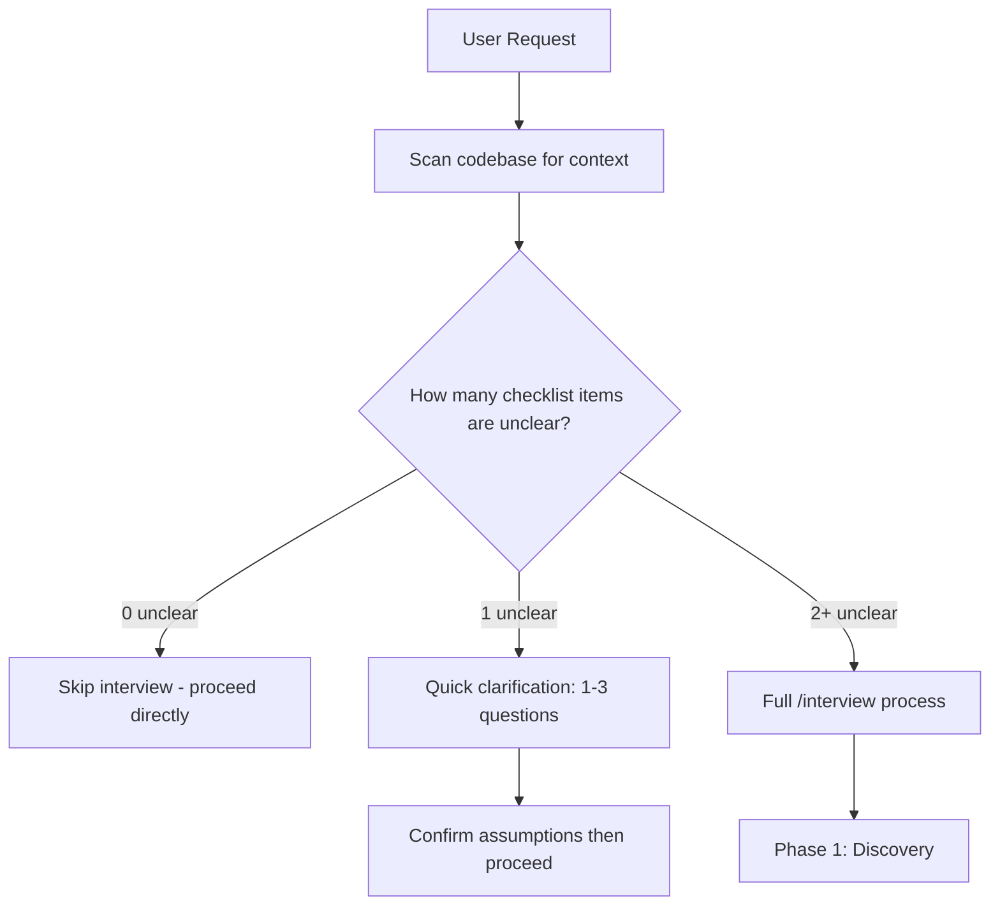

# Interview - Structured Discovery for Implementation and Migration Work

A structured interview command that gathers the right context before implementation, migration, or major refactoring.

## Table of Contents

- [Purpose](#purpose)
- [When to Use](#when-to-use)
- [How It Works](#how-it-works)
- [Question Coverage](#question-coverage)
- [Interview Principles](#interview-principles)
- [Output and Deliverables](#output-and-deliverables)
- [Examples](#examples)
- [Command Usage](#command-usage)
- [Tips and Best Practices](#tips-and-best-practices)
- [Advanced Options](#advanced-options)
- [Troubleshooting](#troubleshooting)
- [Metadata](#metadata)

---

## Purpose

Use this command to reduce guesswork before coding. It helps you:

- Collect complete and concrete requirements
- Avoid missing hidden constraints
- Clarify tradeoffs early
- Define clear deliverables and acceptance criteria
- Think through edge cases and failure paths
- Leave with an implementation plan you can execute

Guiding idea: measure twice, cut once.

---

## When to Use

Run `/interview` when you are:

- Starting a new feature
- Planning a migration or large refactor
- Fixing a complex bug with unclear root cause
- Making architecture decisions with tradeoffs
- Integrating with another system or external API
- Changing UI/UX flows that affect behavior
- Working on security- or performance-critical areas

Skip it when:

- The request is trivial and already clear
- It is a small, low-risk quick fix
- You already have full scope, constraints, and plan

### Quick Underspecified Check

Before starting, evaluate if the request needs an interview. It is underspecified if any of these are unclear after reading the codebase:

- [ ] Objective: what should change vs stay the same
- [ ] Done: acceptance criteria, examples, edge cases
- [ ] Scope: which files, components, or users are in or out
- [ ] Constraints: compatibility, performance, style, dependencies, timeline
- [ ] Environment: language and runtime versions, OS, build and test runner
- [ ] Safety: data migration needs, rollout and rollback risk, reversibility

If two or more items are unclear, run the full interview.
If one item is unclear, ask a quick clarification (1-3 questions) and proceed.
If all are clear, skip the interview entirely.



> **Alignment note**: This triage connects to the `assumption_surfacing` and `confusion_management` behaviors defined in [GLOBAL_RULE.md](../../GLOBAL_RULE.md). When uncertain, surface assumptions explicitly rather than guessing.

---

## How It Works

This command runs in three phases.

### Phase 1: Discovery and Context Gathering

Goal: learn from the codebase first, so the interview asks fewer and better questions.

Typical actions:
1. Read project structure and architecture
2. Scan related code for patterns and conventions
3. Review configs (`package.json`, `tsconfig.json`, framework configs)
4. Check docs (`README`, architecture notes, API docs)
5. Narrow focus to the target area

Output:
- Current tech stack
- Existing patterns and conventions
- Relevant files and modules
- Possible constraints

Target duration: 30 to 60 seconds.

---

### Phase 2: Structured Interview

Goal: close all important gaps before implementation starts.

Interview style:
- Prefer closed questions when options are clear
- Include a recommended option with short reasoning
- Ask 3 to 5 questions per round
- Move from broad context to implementation detail
- Ask follow-ups immediately when answers are vague

Iteration logic:

```text
WHILE (important details are missing or ambiguous) {
  1. Run reasoning checklist (Principle 7)
  2. Identify knowledge gaps that survived the filter
  3. Ask 3-5 targeted questions with compact format
  4. Analyze answers
  5. Update understanding
  6. If answer is unclear, ask follow-up right away
}
```

Target duration: 2 to 5 minutes, depending on complexity.

---

### Phase 2.5: Confirm Interpretation

Before generating the full plan, restate the collected requirements:

1. What we are building (1-2 sentences)
2. Key constraints and decisions made
3. What success looks like (acceptance criteria summary)

Ask the user to confirm or correct. Proceed to Phase 3 only after confirmation.

Target duration: 15 to 30 seconds.

---

### Phase 3: Summary and Action Plan

Goal: produce clear artifacts that are ready for execution.

Output includes three documents:

1. Structured summary
2. Implementation checklist
3. Full markdown implementation plan

Template:

```markdown
# Interview Summary: [Feature Name]

## Core Functionality
- [Functionality 1]
- [Functionality 2]

## User Flows
1. [Flow 1]
2. [Flow 2]

## Technical Requirements
- Stack: [Technologies]
- Dependencies: [Packages]
- APIs: [Endpoints/Integrations]

## Constraints
- [Constraint 1]
- [Constraint 2]

## UI/UX Requirements
- [Requirement 1]
- [Requirement 2]

## Tradeoffs and Decisions
- [Decision 1]: [Option] because [Reason]
- [Decision 2]: [Option] because [Reason]

## Security Considerations
- [Concern]
- [Mitigation]

## Performance Requirements
- [Goal]
- [Approach]

## Testing Strategy
- Unit tests: [Scope]
- Integration tests: [Scope]
- E2E tests: [Scope]

## Deliverables
1. [Deliverable 1] - [Acceptance Criteria]
2. [Deliverable 2] - [Acceptance Criteria]

## Edge Cases
- [Case 1] -> [Handling]
- [Case 2] -> [Handling]

## Verification Commands
- Tests: `[command]`
- Lint: `[command]`
- Type check: `[command]`
- Build: `[command]`
```

Target duration: 30 to 60 seconds.

---

## Question Coverage

The interview can cover all of these areas. Scope is adjusted based on the task.

1. Core functionality and user flows
- Feature behavior
- Business rules
- Data model expectations
- State management needs

2. Technical constraints and existing systems
- Stack and framework versions
- Compatibility and architecture limits
- Integration points
- Database and API contracts

3. Implementation details
- File and module organization
- Dependencies to add or update
- Build/config changes
- Environment requirements

4. UI/UX decisions
- Component hierarchy
- Styling strategy
- Responsive behavior
- Accessibility requirements
- Feedback states (loading, success, error)

5. Tradeoffs and priorities
- Performance vs readability
- Simplicity vs flexibility
- Delivery speed vs completeness
- Build now vs defer

6. System integration
- External APIs
- Internal services
- Authn/authz touchpoints
- Caching and event flows

7. Error handling
- Expected failures
- Unexpected failures and fallback behavior
- User-facing messages
- Logging and retry strategy

8. Performance
- Response-time goals
- Rendering and network optimizations
- Lazy loading and code splitting
- Bundle-size constraints

9. Security
- Authentication and authorization rules
- Input validation and sanitization
- XSS/CSRF protection
- Sensitive data handling
- API hardening and rate limiting

10. Concrete deliverables
- Feature-level acceptance criteria
- Definition of Done
- Required documentation and rollout conditions

11. Verification commands
- Test commands
- Lint/type-check commands
- Build and integration commands
- E2E commands

12. Edge cases and constraints
- Boundary values
- Null/undefined behavior
- Empty states
- Race conditions
- Network failure scenarios
- Browser/device compatibility

13. Testing strategy
- Unit coverage targets
- Integration scenarios
- E2E flows
- Performance/security/accessibility testing

14. Documentation requirements
- In-code comments where needed
- README/API updates
- Architecture notes
- Changelog entries

15. Migration concerns (when applicable)
- Backward compatibility
- Data migration plan
- Rollback strategy
- Gradual rollout and feature flags

16. Monitoring and observability
- Logs and metrics
- Alerting thresholds
- Debug visibility
- Runtime performance tracking

Note: the command adapts depth based on complexity and context.

---

## Interview Principles

### 1. Prefer closed questions when possible

Use closed questions if options are known and the goal is fast clarity.

Good example:

```text
Which state management approach should we use?
- Zustand (Recommended - lightweight and TypeScript-friendly)
- Redux Toolkit (strong tooling, more boilerplate)
- React Context (built-in, enough for small scope)
- Jotai (atomic and flexible)
- Other (custom input)
```

Weak example:

```text
Do you want performance optimization?
- Yes
- No
```

Why weak: too broad. Ask for explicit targets instead.

Support compact replies to reduce friction:

- Offer a `defaults` fast-path to accept all recommended choices at once
- Support shorthand format: `1b 2a 3c` to answer multiple questions in one reply
- Include "Not sure - use default" as an option when helpful

Example format:

```text
1) State management?
   a) Zustand (Recommended - lightweight, TypeScript-friendly)
   b) Redux Toolkit (strong tooling, more boilerplate)
   c) Not sure - use default

2) Data fetching?
   a) TanStack Query (Recommended - caching, background refresh)
   b) SWR (simpler API, fewer features)
   c) Custom hooks (full control, more work)

Reply: `defaults` or `1a 2b`
```

### 2. Do not ask what the codebase already tells you

Avoid:
- "Are you using React or Vue?" (read `package.json`)
- "TypeScript or JavaScript?" (check config and files)
- "What styling system do you use?" (scan imports and setup)

Ask instead:
- "Should this follow existing Pattern X, or introduce Pattern Y for this module?"
- "What constraints in the current approach should we preserve?"

### 3. Ask sharp, implementation-ready questions

Strong questions are:
- Specific
- Actionable
- Scoped
- Relevant to build decisions

Example:

```text
What should `/api/users` return?
- Flat array: [{ id, name, email }] (Recommended - simple)
- Nested object: { users: [...], meta: {...} }
- Paginated: { data: [...], page, totalPages }
```

### 4. Follow up immediately when answers are unclear

```text
IF (answer lacks detail) -> ask follow-up now
IF (answer is contradictory) -> resolve conflict now
IF (answer creates new dependency) -> add targeted question
```

### 5. Always provide a recommended option

Why:
- Speeds up decision-making
- Gives practical direction
- Shows tradeoff awareness

How to choose recommendation:
1. Analyze project context and conventions
2. Compare options against maintenance cost
3. Balance speed, quality, and complexity
4. Pick the most practical default

Format:

```text
Option A (Recommended - short reason)
```

### 6. Ask in the right sequence

Order: broad context -> implementation details -> final verification.

Stage 1 (big picture):
- What are we building?
- What is in scope?
- What constraints are fixed?
- What is the timeline?

Stage 2 (details):
- Component/module structure
- Data flow and state
- API and integration contracts
- UI and interaction specifics

Stage 3 (verification):
- Edge cases
- Testing strategy
- Performance/security requirements
- Delivery criteria

### 7. Reason before asking

Before presenting questions, run this internal checklist:

1. What do I already know from scanning the codebase?
2. What am I genuinely uncertain about?
3. Which uncertainties matter right now for the current phase?
4. Can I set reasonable defaults for any of these?
5. For remaining questions, what are the real tradeoffs between options?

Only questions that survive all five filters should be asked.

### 8. Do not act until must-have answers arrive

Until critical questions are answered:
- Do not edit files, run commands, or generate code
- Do not commit to a specific implementation direction
- Low-risk discovery (reading files, scanning structure) is allowed

If the user says "just go ahead" or "proceed with defaults":
1. State your assumptions as a numbered list
2. Wait for explicit confirmation before starting

### 9. Every option needs context and tradeoffs

Bad:

```text
Database: PostgreSQL | MongoDB | SQLite
```

Good:

```text
Database (your data has complex relationships):
- PostgreSQL (relational, ACID, mature ecosystem)
- MongoDB (flexible schema, horizontal scaling)
- SQLite (zero-ops, embedded, single-writer limitation)
```

Each option must answer: why would someone pick this one?

---

## Question Templates

Use these templates to structure questions consistently. Adapt the format to fit the context.

### Technology Choice

When the user must select between valid technical approaches:

```text
[Technology area] for [specific purpose]?
- Option A (Recommended - [1-line reason])
- Option B ([key tradeoff])
- Option C ([key tradeoff])
- Not sure - use default
```

Example:

```text
Authentication library for your Next.js app?
- NextAuth.js v5 (Recommended - native Next.js integration, active community)
- Lucia (lightweight, more manual setup)
- Custom with jose + bcrypt (full control, more maintenance)
- Not sure - use default
```

Use when: selecting frameworks, libraries, tools, or technical approaches.

### Scope Clarification

When requirements are ambiguous and you need to confirm boundaries:

```text
What level of [feature area] do you need?
a) MVP - [minimal description] (Recommended for first iteration)
b) Standard - [moderate description]
c) Full - [comprehensive description]
```

Example:

```text
What level of error handling do you need?
a) MVP - try/catch with generic error messages (Recommended for first iteration)
b) Standard - typed errors, user-friendly messages, basic retry logic
c) Full - error boundaries, granular error types, retry with backoff, error reporting
```

Use when: the feature has natural tiers of completeness (MVP / Standard / Full).

### UX Decision

When user-facing behavior has multiple valid options:

```text
How should [interaction] behave?
- Option A (Recommended - [user benefit])
- Option B ([user benefit])
- Option C ([user benefit])
```

Example:

```text
How should form validation feedback appear?
- Inline errors on blur (Recommended - immediate feedback without interruption)
- Inline errors on submit (less noisy, but delayed feedback)
- Toast notification (non-blocking, but easy to miss)
```

Use when: choosing user-facing behavior, layout, interaction patterns, or feedback mechanisms.

### Architecture Decision

When structural or design pattern choices affect the codebase long-term:

```text
Architecture approach for [component/system]?
- Option A (Recommended - [architectural benefit])
- Option B ([architectural benefit])
- Option C ([architectural benefit])

Impact: [what this decision affects downstream]
```

Example:

```text
State management architecture for the dashboard?
- Feature-based stores with Zustand (Recommended - collocated state, easy testing)
- Global Redux store (centralized, strong devtools)
- React Context per feature (no dependencies, limited performance)

Impact: affects component coupling, testing strategy, and bundle size.
```

Use when: choosing patterns, module boundaries, data flow strategies, or structural decisions.

---

## Anti-Patterns

Avoid these common interview mistakes:

1. **Do not ask generic questions without codebase context** - always scan first, then ask about what you could not determine
2. **Do not ask about things already decided** - check `package.json`, config files, and existing code before asking about stack choices
3. **Do not use yes/no when multiple options exist** - offer concrete alternatives with tradeoffs instead
4. **Do not overwhelm with more than 5 questions per round** - batch into focused rounds of 3-5 questions
5. **Do not use vague headers** - bad: "Choice?", good: "Database engine for user data?"
6. **Do not present options without tradeoffs** - every option must explain why someone would pick it (see Principle 9)

---

## Output and Deliverables

After the interview, the command returns:

### 1. Instant summary

```text
Interview complete.

Stats:
- Questions asked: 12
- Duration: 3m 24s
- Coverage: 8/16 areas
- Clarity score: 95%

Feature: [Feature Name]
Deliverables: [N items]
Blockers: [N, if any]
Recommended approach: [Approach Name]

Saved outputs:
- Structured summary
- Implementation checklist
- Full documentation

Next steps:
1. Review summary
2. Confirm approach with team if needed
3. Start implementation
```

### 2. Comprehensive docs

Three generated documents:
- Structured summary
- Implementation checklist
- Full markdown document

### 3. Action-ready suggestions

```bash
# Documentation location
# .cursor/interviews/[feature-name]-[date].md

# Create feature branch
git checkout -b feature/[feature-name]

# Create tracking ticket
# Template included in output

# Begin implementation
# Follow checklist
```

---

## Examples

### Example 1: User Authentication

Input:

```text
/interview

User: "I want email/password auth plus OAuth"
```

Discovery output:

```text
Discovery (30s)

Detected:
- Next.js 14 (App Router)
- Prisma + PostgreSQL
- API routes under /app/api/
- No existing auth library

Recommended options:
- NextAuth.js (best fit for Next.js)
- Lucia (lightweight alternative)
- Custom auth with jose + bcrypt
```

Reasoning (internal, before asking):

```text
Already known from codebase:
- Next.js 14 App Router, Prisma + PostgreSQL, API routes exist
- No auth library installed yet

Genuinely uncertain:
- Which auth library the user prefers
- Which OAuth providers are required
- Session strategy (JWT vs DB)

Defaults I can set:
- NextAuth.js (best Next.js integration)
- JWT sessions (stateless, simpler)
```

Interview sample (round-based, compact format):

```text
Round 1 - Big picture

1) Auth library?
   a) NextAuth.js v5 (Recommended - native Next.js, large community)
   b) Lucia (lightweight, more manual setup)
   c) Custom with jose + bcrypt (full control, more work)
   d) Not sure - use default

2) OAuth providers needed?
   a) Google + GitHub (Recommended - covers most users)
   b) Google + GitHub + Facebook
   c) Google + GitHub + Facebook + X/Twitter
   d) Custom list (specify)

3) Session strategy?
   a) JWT (Recommended - stateless, works well with API routes)
   b) DB sessions (strong revocation, more infrastructure)
   c) Hybrid (JWT short-lived + DB for refresh)

Reply: `defaults` or `1a 2b 3c`
```

Confirm interpretation (Phase 2.5):

```text
Before I build the plan, here is what I understand:

1. We are building email/password auth with Google + GitHub OAuth
2. Key decisions: NextAuth.js v5, JWT sessions, Prisma models
3. Success: users can sign up, log in, reset password, and use OAuth

Please confirm or correct, then I will generate the full plan.
```

Summary sample (shortened):

```markdown
# Interview Summary: User Authentication

## Core Functionality
- Email/password signup and login
- OAuth via Google and GitHub
- Email verification
- Password reset

## Technical Stack
- NextAuth.js v5
- Prisma models: User, Account, Session
- PostgreSQL
- Resend API for email

## Deliverables
1. DB schema updates
2. Auth API routes
3. UI forms (signup/login/reset)
4. Email templates

## Verification Commands
- `npm test`
- `npm run type-check`
- `npm run lint`
- `npm run build`
```

### Example 2: Quick Feature - Dark Mode Toggle (Quick Triage Path)

Input:

```text
/interview

User: "Add a dark mode toggle"
```

Underspecified check:

```text
- [x] Objective: add dark mode toggle (clear)
- [x] Done: toggle works, persists preference (clear)
- [ ] Scope: unclear - which components need dark variants?
- [x] Constraints: Tailwind already in use (clear from codebase)
- [x] Environment: Next.js + Tailwind (clear from codebase)
- [x] Safety: no data migration, low risk (clear)

Result: 1 item unclear -> Quick clarification (skip full interview)
```

Quick clarification (1-3 questions instead of full interview):

```text
I scanned the codebase and most things are clear. One quick question:

1) Which components need dark mode support?
   a) All pages and components (Recommended - consistent experience)
   b) Only the main layout and navigation
   c) Specific pages (list them)

Reply: `defaults` or `1b`
```

Output (short):

```markdown
# Dark Mode Toggle - Plan

## Summary
- Library: next-themes
- Persistence: localStorage
- Default: system
- UI: icon button

## Implementation
1. Install `next-themes`
2. Add `ThemeProvider`
3. Build `ThemeToggle`
4. Update Tailwind config
5. Verify persistence and UI behavior
```

---

## Command Usage

Basic:

```text
/interview
```

With inline context:

```text
/interview

"I want to integrate Stripe payments"
```

With file context:

```text
@src/components/checkout/

/interview

"Refactor checkout to support multiple payment methods"
```

---

## Tips and Best Practices

### For users

1. Before interview
- Bring a rough feature idea
- Know hard constraints (timeline, stack, compliance)
- Share references (designs, similar flows, tickets)

2. During interview
- Answer directly
- Pick recommended options when unsure
- Use custom input only when needed
- Ask for clarification if a question is unclear

3. After interview
- Review summary carefully
- Confirm decisions with team if needed
- Save docs and follow checklist

### For AI

1. Discovery phase
- Move fast, but do not skip critical files
- Gather only context that improves question quality
- Keep this phase under 60 seconds

2. Interview phase
- Start broad, then narrow
- Keep each round to 3-5 questions
- Include recommendation and reason
- Follow up quickly on unclear answers
- Do not ask what can be inferred automatically

3. Summary phase
- Be complete without bloating
- Keep sections scannable
- Include verification commands and edge cases
- End with actionable next steps

---

## Advanced Options

If you want targeted depth:

```text
/interview --focus=security,performance
```

```text
/interview --skip=ui
```

```text
/interview --depth=quick
```

Note: these are placeholders for future enhancement. Current behavior adapts scope automatically from context.

---

## Troubleshooting

Issue: too many questions

Fix:
- Provide more initial context
- Choose recommended options when acceptable
- Explicitly say: "Keep it simple. Start with a basic implementation."

Issue: irrelevant questions

Fix:
- Clarify scope: "Only X is needed, not Y"
- Mark question as not applicable
- Explain why it does not apply

Issue: unsure how to answer

Fix:
- Choose recommended option
- Or ask: "I am not sure, suggest the best default and tradeoffs"

---

## Metadata

- Command: `/interview`
- Version: `1.1.0`
- Created: `2026-02-04`
- Updated: `2026-02-12`
- Language: `English`
- Complexity: `Advanced`
- Dependencies: `AskQuestion` tool
- Estimated duration: `3-8 minutes`

---

## References

- [ask-questions-if-underspecified](https://github.com/thienanblog/awesome-ai-agent-skills) by thienanblog
- [ask-questions skill](https://github.com/the-vampiire/ask-questions-skill) by the-vampiire
- [A practical guide to building agents](https://openai.com/business/guides-and-resources/a-practical-guide-to-building-ai-agents/) by OpenAI
- [GLOBAL_RULE.md](../../GLOBAL_RULE.md) behavioral alignment (assumption_surfacing, confusion_management)

---

## Related Commands

- `/create-command` - create new slash commands
- `/create-rule` - create project rules
- `/council` - multi-agent collaboration
- `/phase-plan` - multi-phase planning

## Related Skills

- `lyra-prompt-optimizer`
- Use after `/interview` to improve prompts for downstream AI agents
- `ask-questions-if-underspecified` - Structured clarification for underspecified requests

Generated by `/create-command`.
